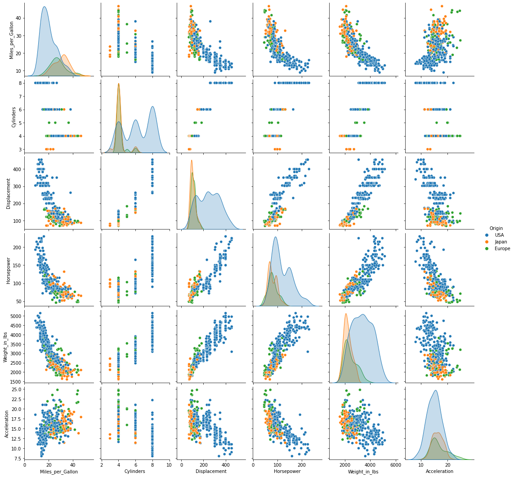
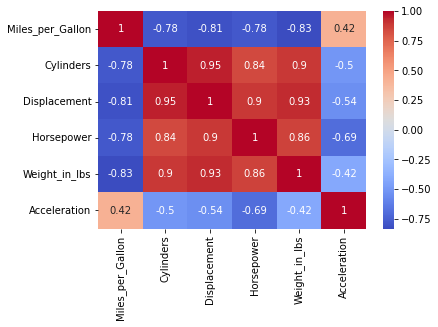
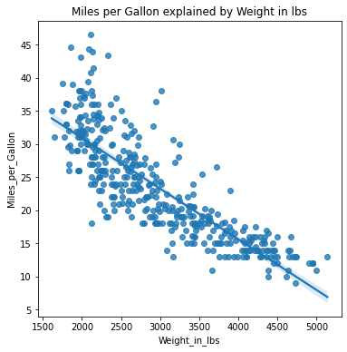
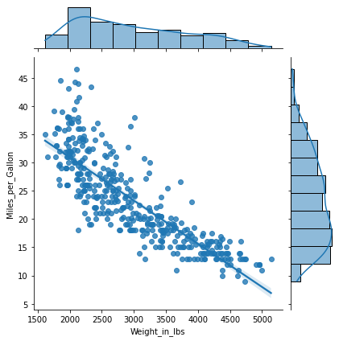

# Simple Linear Regression model (one variable) with sklearn


```python
import pandas as pd
import seaborn as sns
import matplotlib.pyplot as plt
from sklearn import linear_model as lm
import numpy as np
from vega_datasets import data

```

```python
cars = data.cars()
cars.head(3)
```

  <div id="df-654e1bbc-c810-42bf-9bf2-d78470b4b729">
    <div class="colab-df-container">
      <div>
<style scoped>
    .dataframe tbody tr th:only-of-type {
        vertical-align: middle;
    }

    .dataframe tbody tr th {
        vertical-align: top;
    }

    .dataframe thead th {
        text-align: right;
    }
</style>
<table border="1" class="dataframe">
  <thead>
    <tr style="text-align: right;">
      <th></th>
      <th>Name</th>
      <th>Miles_per_Gallon</th>
      <th>Cylinders</th>
      <th>Displacement</th>
      <th>Horsepower</th>
      <th>Weight_in_lbs</th>
      <th>Acceleration</th>
      <th>Year</th>
      <th>Origin</th>
    </tr>
  </thead>
  <tbody>
    <tr>
      <th>0</th>
      <td>chevrolet chevelle malibu</td>
      <td>18.0</td>
      <td>8</td>
      <td>307.0</td>
      <td>130.0</td>
      <td>3504</td>
      <td>12.0</td>
      <td>1970-01-01</td>
      <td>USA</td>
    </tr>
    <tr>
      <th>1</th>
      <td>buick skylark 320</td>
      <td>15.0</td>
      <td>8</td>
      <td>350.0</td>
      <td>165.0</td>
      <td>3693</td>
      <td>11.5</td>
      <td>1970-01-01</td>
      <td>USA</td>
    </tr>
    <tr>
      <th>2</th>
      <td>plymouth satellite</td>
      <td>18.0</td>
      <td>8</td>
      <td>318.0</td>
      <td>150.0</td>
      <td>3436</td>
      <td>11.0</td>
      <td>1970-01-01</td>
      <td>USA</td>
    </tr>
  </tbody>
</table>
</div>
      <button class="colab-df-convert" onclick="convertToInteractive('df-654e1bbc-c810-42bf-9bf2-d78470b4b729')"
              title="Convert this dataframe to an interactive table."
              style="display:none;">

  <svg xmlns="http://www.w3.org/2000/svg" height="24px"viewBox="0 0 24 24"
       width="24px">
    <path d="M0 0h24v24H0V0z" fill="none"/>
    <path d="M18.56 5.44l.94 2.06.94-2.06 2.06-.94-2.06-.94-.94-2.06-.94 2.06-2.06.94zm-11 1L8.5 8.5l.94-2.06 2.06-.94-2.06-.94L8.5 2.5l-.94 2.06-2.06.94zm10 10l.94 2.06.94-2.06 2.06-.94-2.06-.94-.94-2.06-.94 2.06-2.06.94z"/><path d="M17.41 7.96l-1.37-1.37c-.4-.4-.92-.59-1.43-.59-.52 0-1.04.2-1.43.59L10.3 9.45l-7.72 7.72c-.78.78-.78 2.05 0 2.83L4 21.41c.39.39.9.59 1.41.59.51 0 1.02-.2 1.41-.59l7.78-7.78 2.81-2.81c.8-.78.8-2.07 0-2.86zM5.41 20L4 18.59l7.72-7.72 1.47 1.35L5.41 20z"/>
  </svg>
      </button>

  <style>
    .colab-df-container {
      display:flex;
      flex-wrap:wrap;
      gap: 12px;
    }

    .colab-df-convert {
      background-color: #E8F0FE;
      border: none;
      border-radius: 50%;
      cursor: pointer;
      display: none;
      fill: #1967D2;
      height: 32px;
      padding: 0 0 0 0;
      width: 32px;
    }

    .colab-df-convert:hover {
      background-color: #E2EBFA;
      box-shadow: 0px 1px 2px rgba(60, 64, 67, 0.3), 0px 1px 3px 1px rgba(60, 64, 67, 0.15);
      fill: #174EA6;
    }

    [theme=dark] .colab-df-convert {
      background-color: #3B4455;
      fill: #D2E3FC;
    }

    [theme=dark] .colab-df-convert:hover {
      background-color: #434B5C;
      box-shadow: 0px 1px 3px 1px rgba(0, 0, 0, 0.15);
      filter: drop-shadow(0px 1px 2px rgba(0, 0, 0, 0.3));
      fill: #FFFFFF;
    }
  </style>

      <script>
        const buttonEl =
          document.querySelector('#df-654e1bbc-c810-42bf-9bf2-d78470b4b729 button.colab-df-convert');
        buttonEl.style.display =
          google.colab.kernel.accessAllowed ? 'block' : 'none';

        async function convertToInteractive(key) {
          const element = document.querySelector('#df-654e1bbc-c810-42bf-9bf2-d78470b4b729');
          const dataTable =
            await google.colab.kernel.invokeFunction('convertToInteractive',
                                                     [key], {});
          if (!dataTable) return;

          const docLinkHtml = 'Like what you see? Visit the ' +
            '<a target="_blank" href=https://colab.research.google.com/notebooks/data_table.ipynb>data table notebook</a>'
            + ' to learn more about interactive tables.';
          element.innerHTML = '';
          dataTable['output_type'] = 'display_data';
          await google.colab.output.renderOutput(dataTable, element);
          const docLink = document.createElement('div');
          docLink.innerHTML = docLinkHtml;
          element.appendChild(docLink);
        }
      </script>
    </div>
  </div>


```python
cars.info()
```
    <class 'pandas.core.frame.DataFrame'>
    RangeIndex: 406 entries, 0 to 405
    Data columns (total 9 columns):
     #   Column            Non-Null Count  Dtype         
    ---  ------            --------------  -----         
     0   Name              406 non-null    object        
     1   Miles_per_Gallon  398 non-null    float64       
     2   Cylinders         406 non-null    int64         
     3   Displacement      406 non-null    float64       
     4   Horsepower        400 non-null    float64       
     5   Weight_in_lbs     406 non-null    int64         
     6   Acceleration      406 non-null    float64       
     7   Year              406 non-null    datetime64[ns]
     8   Origin            406 non-null    object        
    dtypes: datetime64[ns](1), float64(4), int64(2), object(2)
    memory usage: 28.7+ KB
    
```python
cars = cars.dropna()
```

```python
sns.pairplot(cars, hue="Origin")
plt.show()
```


    
## Correlation Analysis
This step can help give us an idea of the significance of the various variables.
```python
pd.set_option('precision', 3)
cars.corr()
```

  <div id="df-db300143-643d-4de6-9c8c-7d1dd4387322">
    <div class="colab-df-container">
      <div>
<style scoped>
    .dataframe tbody tr th:only-of-type {
        vertical-align: middle;
    }

    .dataframe tbody tr th {
        vertical-align: top;
    }

    .dataframe thead th {
        text-align: right;
    }
</style>
<table border="1" class="dataframe">
  <thead>
    <tr style="text-align: right;">
      <th></th>
      <th>Miles_per_Gallon</th>
      <th>Cylinders</th>
      <th>Displacement</th>
      <th>Horsepower</th>
      <th>Weight_in_lbs</th>
      <th>Acceleration</th>
    </tr>
  </thead>
  <tbody>
    <tr>
      <th>Miles_per_Gallon</th>
      <td>1.000</td>
      <td>-0.778</td>
      <td>-0.805</td>
      <td>-0.778</td>
      <td>-0.832</td>
      <td>0.423</td>
    </tr>
    <tr>
      <th>Cylinders</th>
      <td>-0.778</td>
      <td>1.000</td>
      <td>0.951</td>
      <td>0.843</td>
      <td>0.898</td>
      <td>-0.505</td>
    </tr>
    <tr>
      <th>Displacement</th>
      <td>-0.805</td>
      <td>0.951</td>
      <td>1.000</td>
      <td>0.897</td>
      <td>0.933</td>
      <td>-0.544</td>
    </tr>
    <tr>
      <th>Horsepower</th>
      <td>-0.778</td>
      <td>0.843</td>
      <td>0.897</td>
      <td>1.000</td>
      <td>0.865</td>
      <td>-0.689</td>
    </tr>
    <tr>
      <th>Weight_in_lbs</th>
      <td>-0.832</td>
      <td>0.898</td>
      <td>0.933</td>
      <td>0.865</td>
      <td>1.000</td>
      <td>-0.417</td>
    </tr>
    <tr>
      <th>Acceleration</th>
      <td>0.423</td>
      <td>-0.505</td>
      <td>-0.544</td>
      <td>-0.689</td>
      <td>-0.417</td>
      <td>1.000</td>
    </tr>
  </tbody>
</table>
</div>
      <button class="colab-df-convert" onclick="convertToInteractive('df-db300143-643d-4de6-9c8c-7d1dd4387322')"
              title="Convert this dataframe to an interactive table."
              style="display:none;">

  <svg xmlns="http://www.w3.org/2000/svg" height="24px"viewBox="0 0 24 24"
       width="24px">
    <path d="M0 0h24v24H0V0z" fill="none"/>
    <path d="M18.56 5.44l.94 2.06.94-2.06 2.06-.94-2.06-.94-.94-2.06-.94 2.06-2.06.94zm-11 1L8.5 8.5l.94-2.06 2.06-.94-2.06-.94L8.5 2.5l-.94 2.06-2.06.94zm10 10l.94 2.06.94-2.06 2.06-.94-2.06-.94-.94-2.06-.94 2.06-2.06.94z"/><path d="M17.41 7.96l-1.37-1.37c-.4-.4-.92-.59-1.43-.59-.52 0-1.04.2-1.43.59L10.3 9.45l-7.72 7.72c-.78.78-.78 2.05 0 2.83L4 21.41c.39.39.9.59 1.41.59.51 0 1.02-.2 1.41-.59l7.78-7.78 2.81-2.81c.8-.78.8-2.07 0-2.86zM5.41 20L4 18.59l7.72-7.72 1.47 1.35L5.41 20z"/>
  </svg>
      </button>

  <style>
    .colab-df-container {
      display:flex;
      flex-wrap:wrap;
      gap: 12px;
    }

    .colab-df-convert {
      background-color: #E8F0FE;
      border: none;
      border-radius: 50%;
      cursor: pointer;
      display: none;
      fill: #1967D2;
      height: 32px;
      padding: 0 0 0 0;
      width: 32px;
    }

    .colab-df-convert:hover {
      background-color: #E2EBFA;
      box-shadow: 0px 1px 2px rgba(60, 64, 67, 0.3), 0px 1px 3px 1px rgba(60, 64, 67, 0.15);
      fill: #174EA6;
    }

    [theme=dark] .colab-df-convert {
      background-color: #3B4455;
      fill: #D2E3FC;
    }

    [theme=dark] .colab-df-convert:hover {
      background-color: #434B5C;
      box-shadow: 0px 1px 3px 1px rgba(0, 0, 0, 0.15);
      filter: drop-shadow(0px 1px 2px rgba(0, 0, 0, 0.3));
      fill: #FFFFFF;
    }
  </style>

      <script>
        const buttonEl =
          document.querySelector('#df-db300143-643d-4de6-9c8c-7d1dd4387322 button.colab-df-convert');
        buttonEl.style.display =
          google.colab.kernel.accessAllowed ? 'block' : 'none';

        async function convertToInteractive(key) {
          const element = document.querySelector('#df-db300143-643d-4de6-9c8c-7d1dd4387322');
          const dataTable =
            await google.colab.kernel.invokeFunction('convertToInteractive',
                                                     [key], {});
          if (!dataTable) return;

          const docLinkHtml = 'Like what you see? Visit the ' +
            '<a target="_blank" href=https://colab.research.google.com/notebooks/data_table.ipynb>data table notebook</a>'
            + ' to learn more about interactive tables.';
          element.innerHTML = '';
          dataTable['output_type'] = 'display_data';
          await google.colab.output.renderOutput(dataTable, element);
          const docLink = document.createElement('div');
          docLink.innerHTML = docLinkHtml;
          element.appendChild(docLink);
        }
      </script>
    </div>
  </div>

```python
sns.heatmap(cars.corr(), annot=True, cmap="coolwarm")
plt.show()
```


    


## Linear Regression

```python
X = cars["Weight_in_lbs"].values.reshape(-1, 1)
y = cars["Miles_per_Gallon"]

model = lm.LinearRegression()
model.fit(X, y)
```
 LinearRegression()

```python
print(model.coef_, model.intercept_)
```

    [-0.00764734] 46.21652454901758
    
```python
plt.figure(figsize=(6,6))
sns.regplot(data=cars, x="Weight_in_lbs", y="Miles_per_Gallon")
plt.title("Miles per Gallon explained by Weight in lbs")
plt.show()
```


    
```python
sns.jointplot(data=cars, x="Weight_in_lbs", y="Miles_per_Gallon", kind="reg", height=6)
plt.show()
```
    

    


### Model predictions
```python
model.predict(np.array([4000]).reshape(1,-1))
```
    array([15.62715441])
Il valore individuato sopra fa una previsione sul consumo per una macchina dal peso di 4000 lbs.
